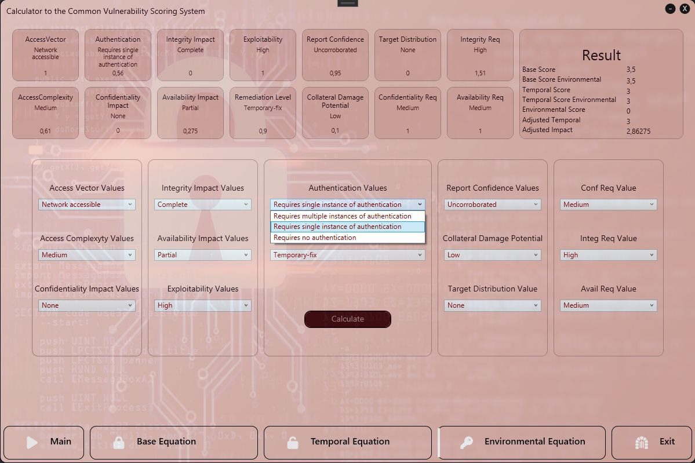

# 🔐 CVSS Score Calculator

A desktop application built with **C# (.NET, WPF)** that allows users to calculate vulnerability scores based on the **Common Vulnerability Scoring System (CVSS)**.  
It supports both **CVSS v2.0** and **CVSS v3.1**, including **Base, Temporal, and Environmental** metrics.  

---

## ✨ Features
- 📊 Calculate **CVSS v2.0** scores:
  - Base metrics  
  - Temporal metrics  
  - Environmental metrics  

- 📈 Calculate **CVSS v3.1** scores:
  - Base metrics  
  - Temporal metrics  
  - Environmental metrics  

- 🎨 Modern **WPF interface** with custom styles  
- 🖼️ Built-in tables for easier understanding of CVSS metrics  
- 💾 Easy-to-use standalone desktop application  

- Calculation metrics
<p align="center">
  
  
</p>
---

## 📂 Project Structure
```
CVSS_Score_Calculator-master/
│── PZ_APP.sln                # Visual Studio solution
│── PZ_APP/                   # Main project
│   ├── App.xaml              # WPF entry
│   ├── MainWindow.xaml       # Main UI
│   ├── Images/               # UI images and tables
│   ├── Styles/               # XAML styles
│   ├── Models/               # CVSS v2.0 & v3.1 models
│   ├── Repositories/         # Equation repositories
│   ├── ViewModels/           # MVVM bindings
│   └── Properties/           # Assembly and settings
```

---

## ⚙️ Requirements
- **.NET Framework 4.7.2+** (or .NET 5/6 if migrated)  
- **Visual Studio 2019/2022** with WPF workload  

---

## 🔧 Build & Run
1. Open the solution file:
   ```bash
   PZ_APP.sln
   ```
   in Visual Studio.  

2. Restore NuGet packages:
   ```bash
   dotnet restore
   ```

3. Build and run:
   ```bash
   dotnet build
   dotnet run
   ```

---

## 🖼️ Screenshots


<p align="center">
  
  
</p>

---

## 🛠️ Development
- Language: **C#**  
- Framework: **.NET / WPF**  
- Pattern: **MVVM (Model-View-ViewModel)**  

---
